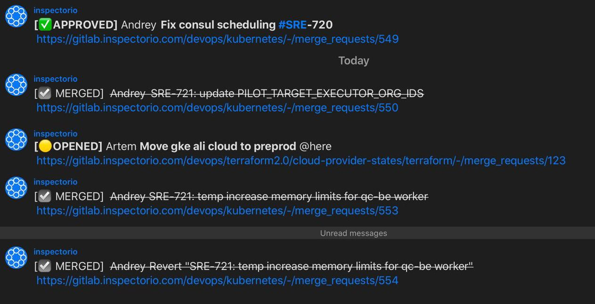

# gitlabMRNotify
Send IM message then gitlab MR(merge request) is OPENED and after that edit the message then any MR action is happens
This concept provides the ability to know MR status from IM message history.

In the case of simplicity, this service is stateless. After a restart, it forgets all message ids and can't edit old messages. 

This service use gitlab project webhook to get the information about MR actions. 

Logic process:

* Run http server and wait webhook.
* We receive merge action json, parse them and make request to determine is that MR already approved. 
* Check global map for message that we should edit, if not write new message to IM and paste id to global map variable. 
